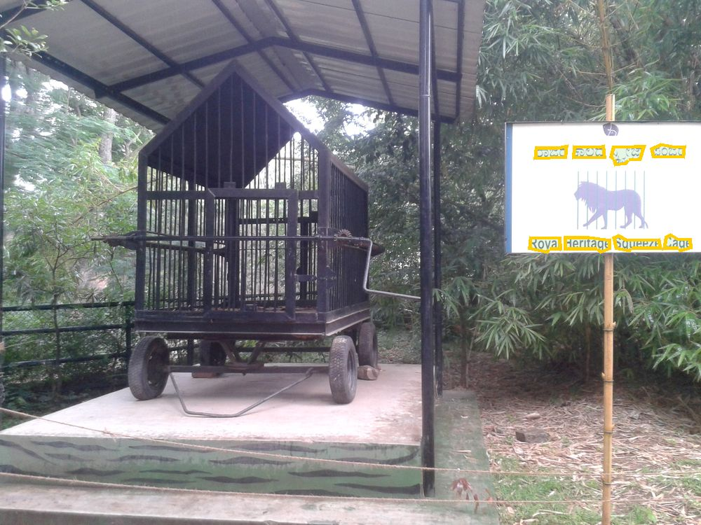

# India in the Wild

Tests whether vision-language models can read what India actually looks
like: hand-painted shop signage, price and fare boards, bilingual and
multi-script hoardings — photographed in the wild, not scanned clean
printed pages. Every item has a verifiable gold answer (the sign says what
it says), so scoring is programmatic, not model-judged.

**Current scope:** full-image reading, sourced from [BSTD](#dataset), a
scene-text-in-the-wild dataset covering 14 Indian scripts. This does not
cover handwritten forms or printed documents (lab reports, etc.) — BSTD is
street-scene photography, not document photography; a different source
would be needed for that leg.

**Eight open-weight vision-language models** have been run over BSTD's full
`test` split (1,319 images, 24,987 gold text items) under an identical prompt
and manifest.

## Task

A model is shown one full, unedited photograph and asked to transcribe
every piece of legible text it can read, in its original script, one item
per line (exact wording: [`scripts/prompts.py`](scripts/prompts.py)). No
cropping, no hints about where the text is — the model has to both find
and read it.

## Dataset

BSTD is [BharatSceneTextDataset](https://github.com/Bhashini-IITJ/BharatSceneTextDataset),
a scene-text dataset of real photographs from across India,
annotated at the word/phrase level with a polygon, transcribed text, and a
script-language label, across English, Hindi,
Bengali, Tamil, Telugu, Kannada, Malayalam, Marathi, Gujarati, Punjabi,
Odia, Assamese, Urdu, and Meitei. This repo's benchmark runs on BSTD's own
`test` split only (`--split test`).



*A BSTD image with its ground truth overlaid — a museum label at Mysore
Zoo, four Kannada words above their English translation, each word boxed
as a separate annotation. A model is shown the plain photo (no boxes);
these mark what its transcription is scored against.
[Source photo](https://commons.wikimedia.org/wiki/File:Animals_in_Mysore_Zoo_2015_Pic24.jpg)
by Vis M, [CC BY-SA 4.0](https://creativecommons.org/licenses/by-sa/4.0/).*

### Cleaning applied

`build_benchmark.py` normalizes noisy `script_language` labels, drops
3,143 `"UNK"`/`"NA"` placeholder annotations in the `test` split instead
of scoring them as gold text, and reads each entry's own file extension
instead of guessing one (recovering 60 `test`-split images an earlier
version dropped as "missing" for having a non-`.jpg` extension).

## Repo layout

```
scripts/
  build_benchmark.py   curates BSTD -> a manifest (this repo's only data-cleaning step)
  prompts.py           the exact prompt text used for the reading task
  run_inference.py     client that sends manifest images to a vLLM-served model
  score.py             scores predictions against manifest gold text
configs/
  qwen7b_test_split.yaml      Qwen2.5-VL-7B
  qwen32b_test_split.yaml     Qwen2.5-VL-32B
  gemma3_test_split.yaml      Gemma-3-27B
  aria_test_split.yaml        Aria
  minicpmv26_test_split.yaml  MiniCPM-V-2.6
  pixtral_test_split.yaml     Pixtral-12B
  llava16_34b_test_split.yaml LLaVA-1.6-34B
  ayavision_test_split.yaml   Aya-Vision-8B
dataset/
  manifest_test.json          every BSTD "test"-split image, no exceptions (1,319 images)
```

One config per leaderboard model, same manifest and prompt throughout --
`qwen7b_test_split.yaml` is the one "Running it" walks through end to
end; every other config is a drop-in swap for its step 3. Running one
produces a `results/<run_name>/` directory: `predictions.json` (raw
model output per image, plus per-image latency/token counts),
`run.log` (timestamped progress and timing summary), and once scored,
`scores.json` (recall/precision/F1, overall and per dominant script).
Generated locally, not committed.

## Running it

```bash
python3 -m venv venv && source venv/bin/activate
pip install -r requirements.txt

# 1. build the full test-split manifest from BSTD -- optional, dataset/ is already committed
python3 scripts/build_benchmark.py --out dataset/manifest_test.json --split test --per-script-cap 999999

# 2. serve a vision-capable model with vLLM (separate terminal)
vllm serve Qwen/Qwen2.5-VL-7B-Instruct --port 8234

# 3. run the benchmark and score it
python3 scripts/run_inference.py --config configs/qwen7b_test_split.yaml
python3 scripts/score.py \
  --manifest dataset/manifest_test.json \
  --predictions results/test-split-qwen2.5-vl-7b/predictions.json \
  --out results/test-split-qwen2.5-vl-7b/scores.json
```

To run any other leaderboard model, serve its checkpoint (step 2) and swap
in that model's config for step 3 — each file in `configs/` carries the
exact `vllm serve` command it needs in its header comment.

`run_inference.py` only talks to an OpenAI-compatible endpoint (`base_url`
+ `model` in the config) — swap in any other vLLM-served checkpoint, or
point it at a hosted API that accepts the same chat-completions
image-input format, without changing the script.

## Scoring

Two complementary metrics, each with an exact and a fuzzy variant, combined into F1:

- **recall** — of BSTD's gold text, how much did the model find? For every
  gold string, does it appear (exact substring, or a fuzzy-matching output
  line) anywhere in the model's output.
- **precision** — of the model's output, how much is real? For every line
  the model produced, is it supported by some gold string (exact substring
  either direction, or a fuzzy match) — the complement to recall: on images
  with *zero* gold text, does the model still claim to read something?

Exact/fuzzy definitions: **exact** is a normalized substring match; **fuzzy**
additionally counts a match within 0.8 similarity
([`difflib.SequenceMatcher`](https://docs.python.org/3/library/difflib.html)),
forgiving a dropped matra or a single swapped character without forgiving a
wrong reading. Neither metric checks ordering.

**Precision comes with a real caveat, unlike recall.** BSTD's annotation
coverage is not guaranteed exhaustive — a busy photo may have real,
legible text nobody bothered to annotate. Recall doesn't care (it only
checks whether annotated text was found), but precision does: a model
correctly reading real text BSTD's annotators skipped counts as a "false
positive" here even though the model did nothing wrong. Treat precision as
an upper bound on apparent hallucination, not a clean ground-truth
measurement — see `scripts/score.py`'s module docstring for the full
reasoning.

## Results

All eight models saw the identical manifest (`dataset/manifest_test.json`,
1,319 images), the identical prompt (`READ_ALL_TEXT` in
[`scripts/prompts.py`](scripts/prompts.py)), temperature 0, `max_tokens`
1024 and concurrency 8 -- less the one or two images per model that failed
every retry. Rows are ordered by fuzzy recall.

| # | model | checkpoint | recall (exact/fuzzy) | precision (exact/fuzzy) | F1 (exact/fuzzy) |
|---|---|---|---|---|---|
| 1 | Qwen2.5-VL-32B | `Qwen/Qwen2.5-VL-32B-Instruct` | 0.444 / 0.460 | 0.461 / 0.483 | 0.453 / **0.471** |
| 2 | Qwen2.5-VL-7B | `Qwen/Qwen2.5-VL-7B-Instruct` | 0.386 / 0.397 | **0.548 / 0.564** | 0.453 / 0.466 |
| 3 | Gemma-3-27B | `google/gemma-3-27b-it` | 0.292 / 0.302 | 0.414 / 0.434 | 0.343 / 0.356 |
| 4 | Aria | `rhymes-ai/Aria` | 0.176 / 0.179 | 0.242 / 0.245 | 0.204 / 0.207 |
| 5 | MiniCPM-V-2.6 | `openbmb/MiniCPM-V-2_6` | 0.151 / 0.154 | 0.376 / 0.395 | 0.216 / 0.221 |
| 6 | Pixtral-12B | `mistralai/Pixtral-12B-2409` | 0.119 / 0.121 | 0.322 / 0.330 | 0.173 / 0.178 |
| 7 | LLaVA-1.6-34B | `llava-hf/llava-v1.6-34b-hf` | 0.115 / 0.116 | 0.439 / 0.442 | 0.182 / 0.184 |
| 8 | Aya-Vision-8B | `CohereForAI/aya-vision-8b` | 0.056 / 0.059 | 0.297 / 0.308 | 0.094 / 0.098 |

**Decoding is identical across rows except for one setting: Pixtral-12B and
LLaVA-1.6-34B ran at `repetition_penalty` 1.30, the other six at 1.05** --
so any comparison involving those two rows is not strictly controlled.

## License

**Code** — everything under `scripts/` and `configs/` — is MIT licensed; see
[`LICENSE`](LICENSE). Copyright (c) 2026 Sthānika AI.

**Data belongs to BSTD**, not covered by the MIT grant above.
[BSTD](https://github.com/Bhashini-IITJ/BharatSceneTextDataset) is
Apache-2.0 licensed, and its README states every image is CC BY-SA 4.0,
sourced from Wikimedia Commons. If you use this benchmark, cite BSTD's
underlying paper per its README.
